# 🌶️ Eat & Chill: The Food Fight Bot

## 🎯 Overview
Eat & Chill is a Slack bot that sparks food debates by collecting unpopular food opinions. Using Netlify functions and serverless architecture, it connects Slack interactions with Notion for persistent debate tracking.

## ✨ Key Features
- One-click food debates with `/heat-eat`
- Spice level rating system
- Notion integration for debate tracking
- Serverless architecture with Netlify
- Weekly scheduled reminders via cron jobs
- Live tunneling for real-time interactions

## 🛠️ Tech Stack
- 
- 
- 
- 

## 🏗️ Architecture

```mermaid
flowchart TB
    subgraph Slack["Slack Workspace"]
        Command["/heat-eat Command"]
        Channel["Channel Notifications"]
    end

    subgraph Netlify["Netlify Infrastructure"]
        direction TB
        Tunnel["Live Tunnel"]
        
        subgraph Functions["Serverless Functions"]
            Handler["Command Handler"]
            Modal["Modal Interface"]
            Notify["Notification Service"]
        end
        
        subgraph Scheduled["Scheduled Jobs"]
            Cron["Weekly Reminder\n(Monday 9 AM)"]
        end
    end

    subgraph Notion["Notion Database"]
        Records["Debate Records"]
        subgraph Fields["Database Fields"]
            Opinion["Food Opinion"]
            Spice["Spice Level"]
            Status["Debate Status"]
        end
    end

    Command -->|"Trigger"| Tunnel
    Tunnel -->|"Route"| Handler
    Handler -->|"Display"| Modal
    Modal -->|"Store"| Records
    Modal -->|"Announce"| Channel
    
    Cron -->|"Check"| Records
    Cron -->|"Update"| Channel
    
    Records --> Fields

    classDef slack fill:#4A154B,stroke:#1A1A1A,stroke-width:2px,color:white
    classDef netlify fill:#00AD9F,stroke:#1A1A1A,stroke-width:2px,color:white
    classDef notion fill:#000000,stroke:#1A1A1A,stroke-width:2px,color:white
    classDef functions fill:#00AD9F,stroke:#1A1A1A,stroke-width:2px,opacity:0.7
    classDef fields fill:#000000,stroke:#1A1A1A,stroke-width:2px,opacity:0.7

    class Slack slack
    class Netlify,Functions,Scheduled netlify
    class Notion,Fields notion
```

## 📸 Screenshots
**Remainder of pending discussions**


**Slacbot dialogbox**


## 🚀 Development Setup

### Prerequisites
- Node.js (v18+)
- Netlify CLI
- Slack Workspace
- Notion Account

### Netlify Configuration
1. Install Netlify CLI: npm install -g netlify-cli
2. Create live tunnel: ntl dev --live
3. Configure serverless functions
4. Set up scheduled functions

### Slack Setup
1. Create Slack App
2. Configure slash command `/heat-eat`
3. Set OAuth scopes
4. Add Netlify URL as endpoint

### Notion Integration
1. Create integration
2. Configure database
3. Set up API access

### Environment Variables
Required in Netlify:
- NOTION_SECRET=your_notion_secret
- NOTION_DATABASE_ID=your_database_id
- SLACK_BOT_TOKEN=your_slack_bot_token
- SLACK_SIGNING_SECRET=your_signing_secret
- SLACK_CHANNEL_ID=target_channel_id

## 💡 Implementation Details

### Serverless Functions
1. **Slash Command Handler**
   - Processes `/heat-eat` command
   - Triggers modal for opinion input
   - Handles spice level selection

2. **Notion Integration**
   - Creates debate entries
   - Updates discussion status
   - Tracks participation

3. **Weekly Service Worker**
   - Scheduled Netlify function
   - Runs every Monday at 9 AM
   - Sends channel reminders
   - Updates debate statuses

### Netlify Scheduled Function
### Netlify Scheduled Function
```javascript
// Weekly reminder function
exports.handler = schedule('0 9 * * 1', async () => {
 // Check pending debates
 // Send channel updates
 // Update Notion status
});
```

## 📱 User Flow
1. User triggers `/heat-eat`
2. Bot presents opinion input modal
3. Opinion stored in Notion
4. Channel notification sent
5. Weekly reminders via cron job

## 🤝 Contributing
1. Fork repository
2. Create feature branch
3. Submit pull request

## 📝 License
[MIT](LICENSE)

## 🙏 Acknowledgments
Based on [Frontend Masters course](https://frontendmasters.com/courses/chat-apis/) by Jason Lengstorf
